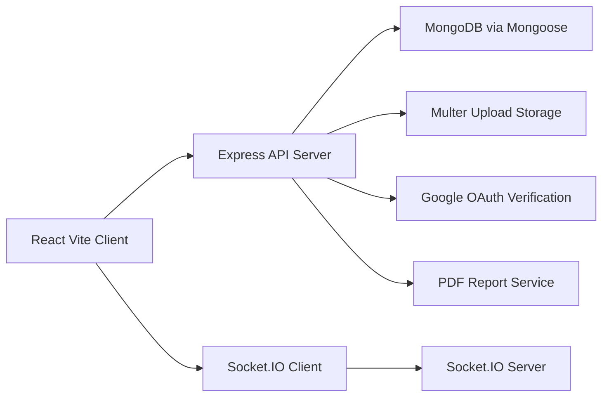
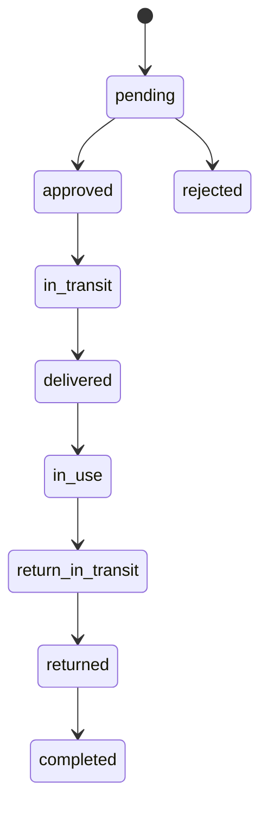

# JustRentIt Project Documentation

## Cover Page

**Project Title:** JustRentIt - Rental Marketplace Platform  
**Project Type:** Full Stack Web Application  
**Academic Use:** Major Project Submission  
**Department:** Computer Engineering / Information Technology  
**Team Members:** _(Add names and enrollment numbers)_  
**Guide:** _(Add guide name)_  
**Institute:** _(Add college name)_  
**Academic Year:** 2025-2026

---

## Certificate Page (Template)

This is to certify that the project titled **"JustRentIt - Rental Marketplace Platform"** is a bonafide work carried out by **_(Student Names)_** under my guidance in partial fulfillment of the requirements for the award of the degree of **_(Degree Name)_** during the academic year **2025-2026**.

**Guide Signature:** __________  
**Head of Department:** __________  
**Date:** __________  
**Place:** __________

---

## Acknowledgement

We express our sincere gratitude to our project guide, faculty members, and department for their continuous support and valuable guidance during the development of the **JustRentIt** project. We also thank our peers and family members for their encouragement and suggestions throughout the project lifecycle.

The successful completion of this project was possible due to collaborative effort in planning, implementation, testing, and refinement of both frontend and backend modules.

---

## Abstract

**JustRentIt** is a full-stack rental marketplace web application designed to connect product owners and renters in a secure and structured workflow. The platform enables users to register, authenticate, list rentable products, request rentals, track rental progress, communicate through chat, and submit ratings. In addition to user-level features, the system includes an admin dashboard for managing users, products, categories, rental requests, analytics, and PDF report generation.

The frontend is developed using **React (Vite)** with component-based architecture and route-driven navigation. The backend is built on **Node.js + Express**, with **MongoDB (Mongoose)** as the persistent data store. Authentication is implemented using **JWT** and **Google OAuth login**, while media uploads are handled through **Multer**. Real-time communication is supported through **Socket.IO**.

The system focuses on workflow transparency by introducing a multi-stage rental lifecycle that includes request approval, delivery transit, delivery confirmation using OTP, usage, return transit, and completion. Notification mechanisms and rating modules improve trust and user engagement. The admin module provides centralized governance over platform data and supports business monitoring with analytics and downloadable PDF reports.

Overall, JustRentIt demonstrates practical integration of modern web technologies for solving rental coordination challenges and offers a scalable base for further enhancements such as stronger security hardening, payment gateway integration, and automated moderation.

---

## Table of Contents

1. Introduction  
2. Existing System and Proposed System  
3. System Analysis and Design  
4. Technology Stack  
5. Database Design  
6. API Documentation  
7. Implementation Details  
8. UI/UX Overview  
9. Testing and Validation  
10. Security, Limitations, and Risks  
11. Future Enhancements  
12. Conclusion  
13. References  
14. Appendix

---

## 1. Introduction

### 1.1 Background
Local rental exchange is often managed through unstructured social channels where users face issues such as low trust, incomplete information, no clear status tracking, and weak communication workflows.

### 1.2 Problem Statement
Traditional renting methods lack:
- Structured rental lifecycle management
- User verification and role-based moderation
- Real-time buyer-owner communication
- Centralized analytics and reporting for administrators

### 1.3 Objectives
- Build a secure platform for item rental listing and request management
- Support both standard login and Google OAuth login
- Provide renter-owner chat and request tracking
- Add admin-level controls for platform governance
- Enable rating and notification features for trust and engagement

### 1.4 Scope
- Web-based platform for users and admins
- Product listing, request workflow, chat, ratings, notifications
- Admin analytics and downloadable report generation

### 1.5 Expected Outcomes
- Improved rental management transparency
- Better user interaction and accountability
- Extensible architecture for future production-level features

---

## 2. Existing System and Proposed System

### 2.1 Existing System Issues
- Manual negotiations via calls/messages
- No standardized status management
- No secure authentication and no ownership tracking
- Limited or no data-driven admin oversight

### 2.2 Proposed System (JustRentIt)
JustRentIt introduces:
- Centralized account system with JWT authentication
- Product catalog with category and location metadata
- Structured rental lifecycle with status transitions and OTP checks
- Real-time and API-based chat
- Admin dashboard for users/products/rentals/categories/analytics
- Notification and rating modules

### 2.3 Advantages
- Transparent lifecycle from request to completion
- Better moderation with role-based admin controls
- Persistent history and analytics for informed decision-making

---

## 3. System Analysis and Design

### 3.1 Functional Requirements
- User registration and login (including Google login)
- Profile management (photo, phone, address)
- Product listing with image upload and metadata
- Rental request creation and status updates
- OTP-based status confirmation in rental stages
- Chat between users (REST + Socket.IO)
- Rating of users/products after rental
- Notification retrieval and read-marking
- Admin management modules and analytics

### 3.2 Non-Functional Requirements
- Usability: Multi-page route-driven UX
- Performance: Pagination and filtered queries in admin/product views
- Security: JWT-protected routes, role checks, basic validation
- Maintainability: Modular route and model separation
- Scalability: Separate client/server and schema-driven persistence

### 3.3 User Roles
- **User**
  - Register/login
  - Add products
  - Create and track rental requests
  - Chat and rate
- **Admin**
  - Manage users
  - Verify/feature/delete products
  - Manage rental statuses
  - View analytics and generate reports

### 3.4 High-Level Architecture



### 3.5 Rental Lifecycle Design



### 3.6 Module Breakdown
- Authentication and User Management
- Product and Category Management
- Rental Request and Progress Tracking
- Chat and Messaging
- Notification System
- Ratings System
- Admin Analytics and Reporting

---

## 4. Technology Stack

### 4.1 Frontend
- React 18
- Vite
- React Router
- Axios
- Mantine UI, Bootstrap, icon libraries

### 4.2 Backend
- Node.js
- Express
- JWT (`jsonwebtoken`)
- Multer for image upload
- Socket.IO for real-time chat
- PDFKit for PDF generation

### 4.3 Database
- MongoDB
- Mongoose ODM

### 4.4 Authentication and Security
- JWT token-based auth
- Google OAuth token verification (`google-auth-library`)
- Admin role checks in middleware

### 4.5 Developer Tooling
- ESLint (client)
- Nodemon (server)

---

## 5. Database Design

### 5.1 `Users`
| Field | Type | Notes |
|---|---|---|
| name | String | Required |
| email | String | Required, unique |
| phone | String | Unique, sparse |
| password | String | Optional (Google users may not have local password) |
| googleId | String | Unique, sparse |
| profilePhoto | String | Upload/URL |
| address | String | Optional |
| currentLocation | Object | latitude/longitude |
| about | String | Optional |
| role | String | Enum: `User`, `Admin` |
| ratings | Number | Aggregate user rating |
| isVerified | Boolean | Verification flag |

### 5.2 `RentProduct`
| Field | Type | Notes |
|---|---|---|
| name | String | Required |
| description | String | Required |
| rentalPrice | Number | Required |
| securityDeposit | Number | Default 0 |
| rentalDuration | String | Enum: hour/day/week/month |
| condition | String | Enum values |
| category | ObjectId[] | Ref `Category` |
| images | String[] | Uploaded image paths |
| userId | ObjectId | Ref `User` |
| available | Boolean | Availability flag |
| isForSale | Boolean | Sale option |
| featured | Boolean | Admin-managed flag |
| sellingPrice | Number | Conditional validation |
| location | Object | country/state/area/pincode |
| ratings | Object | `totalRatings`, `averageRating` |
| verified | Boolean | Admin verification |

### 5.3 `RentalRequest`
| Field | Type | Notes |
|---|---|---|
| product | ObjectId | Ref `RentProduct` |
| requester | ObjectId | Ref `User` |
| owner | ObjectId | Ref `User` |
| startDate | Date | Required |
| endDate | Date | Required |
| status | String | Enum lifecycle |
| message | String | Optional |
| deliveryOTP | String | Delivery confirmation OTP |
| returnOTP | String | Return confirmation OTP |
| currentStatus | Array | Stage history with timestamp |

### 5.4 `Category`
| Field | Type | Notes |
|---|---|---|
| name | String | Required, unique |

### 5.5 `ChatMessage`
| Field | Type | Notes |
|---|---|---|
| sender | ObjectId | Ref `User` |
| receiver | ObjectId | Ref `User` |
| content | String | Required for text messages |
| messageType | String | `text` or `image` |
| imageUrl | String | Optional |
| read | Boolean | Read flag |
| createdAt | Date | Timestamp |

**Indexes present:**
- `{ sender: 1, receiver: 1 }`
- `{ createdAt: -1 }`

### 5.6 `Rating`
| Field | Type | Notes |
|---|---|---|
| rater | ObjectId | Ref `User` |
| ratedUser | ObjectId | For user ratings |
| ratedProduct | ObjectId | For product ratings |
| rentalRequest | ObjectId | Ref `RentalRequest` |
| rating | Number | 1 to 5 |
| comment | String | Optional |
| type | String | Enum: `user`, `product` |

### 5.7 `Notification`
| Field | Type | Notes |
|---|---|---|
| userId | ObjectId | Target user |
| message | String | Notification text |
| type | String | Enum types |
| read | Boolean | Read state |
| metadata | Mixed | Optional payload |

---

## 6. API Documentation

> Base URL is controlled by frontend variable `VITE_API_BASE_URL`.

### 6.1 Auth & Profile
| Method | Endpoint | Auth | Description |
|---|---|---|---|
| POST | `/register` | No | Register user with optional profile photo |
| POST | `/login` | No | User login and JWT issuance |
| POST | `/api/auth/google` | No | Google login using credential token |
| GET | `/getUserProfile?userId=` | No | Fetch user profile by id |
| POST | `/updateProfile` | No* | Update profile fields/photo |

### 6.2 Product and Category
| Method | Endpoint | Auth | Description |
|---|---|---|---|
| POST | `/rentproduct/add` | Yes | Add rentable product |
| GET | `/api/my-products` | Yes | Get user products by query `userId` |
| PUT | `/api/update-product/:productId` | No | Update product details/images |
| DELETE | `/api/delete-product/:productId` | No | Delete product |
| GET | `/api/products` | No | List/filter products |
| GET | `/api/products/:id` | No | Product details |
| GET | `/api/products/search` | No | Search product/category |
| GET | `/api/categories` | No | List categories |
| POST | `/api/categories` | No | Add category |
| PUT | `/api/categories/:id` | No | Update category |
| DELETE | `/api/categories/:id` | No | Delete category |
| GET | `/products` | No | Public product filtering endpoint |
| GET | `/products/:categoryId` | No | Products by category |
| GET | `/categories` | No | Categories listing |

### 6.3 Rental Requests
| Method | Endpoint | Auth | Description |
|---|---|---|---|
| GET | `/api/rental-requests` | No | List sent/received requests |
| POST | `/api/rental-requests` | No | Create rental request |
| GET | `/api/rental-requests/check` | No | Check existing pending request |
| PUT | `/api/rental-requests/:id` | No | Update request dates/details |
| DELETE | `/api/rental-requests/:id` | No | Delete request |
| PUT | `/api/rental-requests/:id/status` | No | Update request status with transition checks |
| PUT | `/api/rental-requests/confirm-otp` | No | Confirm delivery/return OTP |
| POST | `/api/chatredirect/rental-requests` | Yes | Create request for chat redirect flow |

### 6.4 Ratings
| Method | Endpoint | Auth | Description |
|---|---|---|---|
| GET | `/api/ratings/check/:requestId` | No* | Check pending ratings |
| POST | `/api/ratings` | No* | Submit rating |

### 6.5 Notifications
| Method | Endpoint | Auth | Description |
|---|---|---|---|
| GET | `/notifications?userId=` | No | Get latest notifications |
| PUT | `/notifications/:id/read` | No | Mark as read |

### 6.6 Chat APIs
| Method | Endpoint | Auth | Description |
|---|---|---|---|
| GET | `/api/chat/` | Yes | Get users except current |
| GET | `/api/chat/:senderId/:receiverId` | Yes | Get chat history |
| POST | `/api/chat/` | Yes | Send text/image message |
| GET | `/api/chat/users/:userId` | Yes | Chat contacts for user |
| GET | `/api/chat/:id` | Yes | User details |
| DELETE | `/api/chat/:senderId/:receiverId` | Yes | Delete chat history |

### 6.7 Dashboard & Analytics
| Method | Endpoint | Auth | Description |
|---|---|---|---|
| GET | `/api/dashboard-stats` | Yes | User dashboard stats |
| GET | `/api/analytics/users` | No | User analytics |
| GET | `/api/analytics/products` | No | Product analytics |
| GET | `/api/analytics/rentals` | No | Rental analytics |
| GET | `/api/admin/stats` | No | Admin summary stats |

### 6.8 Admin Management
| Method | Endpoint | Auth | Description |
|---|---|---|---|
| GET | `/api/admin/users` | Yes + Admin | User listing/search |
| PUT | `/api/admin/users/:id/role` | Yes + Admin | Update role |
| PUT | `/api/admin/users/:id/verify` | Yes + Admin | Verify user |
| POST | `/api/admin/users/bulk-verify` | Yes + Admin | Bulk verify users |
| DELETE | `/api/admin/users/:id` | Yes + Admin | Delete user |
| GET | `/api/users` | Yes + Admin | Alternate user list route |
| PATCH | `/api/users/:userId/role` | Yes + Admin | Alternate role route |
| DELETE | `/api/users/:userId` | Yes + Admin | Alternate delete route |
| GET | `/api/admin/products` | Yes + Admin | Product management list |
| PUT | `/api/admin/products/:id/verify` | Yes + Admin | Verify/unverify product |
| PUT | `/api/admin/products/:id/feature` | Yes + Admin | Feature toggle |
| PUT | `/api/admin/products/:id` | Yes + Admin | Admin product update |
| DELETE | `/api/admin/products/:id` | Yes + Admin | Admin product delete |
| GET | `/api/admin/rentals` | Yes + Admin | Admin rental list |
| PUT | `/api/admin/rentals/:id/status` | Yes + Admin | Admin rental status update |
| GET | `/api/admin/generate-report` | Yes + Admin | Generate PDF report |

### 6.9 Health
| Method | Endpoint | Auth | Description |
|---|---|---|---|
| GET | `/api/health` | No | API and DB connectivity status |

---

## 7. Implementation Details

### 7.1 Frontend Flow
- Entry point in `client/src/main.jsx` configures Axios interceptors for JWT injection and session-expiry handling.
- Routing is defined in `client/src/App.jsx` using lazy-loaded pages.
- Dashboard and Admin dashboard are component-switched side-panel layouts.
- API base endpoint is read from `import.meta.env.VITE_API_BASE_URL`.

### 7.2 Backend Flow
- Server initializes in `server/index.js`.
- CORS allows configured `CLIENT_URL` values.
- MongoDB connects using `MONGODB_URI`.
- Route mounting combines direct `app.get/post/...` handlers and modular routers under `/api` and related prefixes.

### 7.3 Authentication Flow
- Standard login:
  - User submits email/password
  - Backend validates and generates JWT (`expiresIn: 12h`)
- Registration:
  - Stores profile image path and hashed password (`sha256$...` format)
- Google login:
  - Backend verifies Google token with `GOOGLE_CLIENT_ID`
  - Existing/new user resolved and JWT issued

### 7.4 Rental Lifecycle and OTP
- Requests start as `pending`
- Transition validation is enforced in `rentalRequests.js`
- OTP generated for critical stages:
  - Delivery flow (`deliveryOTP`)
  - Return flow (`returnOTP`)
- Product availability toggles false on approve and true on complete

### 7.5 Chat Flow
- REST endpoints handle history, contacts, and image message upload.
- Socket.IO handles live events:
  - Auth via token passed in handshake query
  - `joinChat` joins room by user ID
  - `sendMessage` stores DB record and emits `receiveMessage`

### 7.6 Report Generation
- Admin can call `/api/admin/generate-report`
- Server compiles users/products/rentals/categories stats
- PDFKit streams report directly as downloadable PDF

---

## 8. UI/UX Overview

### 8.1 Main User Pages
- Home (`/`)
- Register/Login (`/register`, `/login`)
- Product browsing (`/products`, `/product/:id`)
- User profile (`/profile`)
- User dashboard (`/dashboard`) with:
  - Profile
  - My Products
  - Add Product
  - Rental Requests
  - Chat

### 8.2 Admin Pages
- Admin dashboard (`/admin`) with:
  - Overview
  - User Management
  - Product Management
  - Category Management
  - Rental Management
  - Analytics
  - Chat
  - Profile
  - Report generation

### 8.3 Styling
- Global CSS variables and gradients are used in `client/src/main.css`.
- Component-level CSS files style specific modules.

---

## 9. Testing and Validation

### 9.1 Current State
- No formal automated test suite found in repository.
- Validation is mainly route-level and schema-level.

### 9.2 Recommended Functional Test Cases
- Register with duplicate email/phone
- Login with invalid credentials and expired token handling
- Add product with/without required fields and images
- Create rental request and verify duplicate request prevention
- Validate all rental status transitions including OTP checks
- Send chat text/image and verify history retrieval
- Submit ratings and validate aggregate update
- Admin verify/feature/delete product operations
- Admin user role/verification/bulk verification
- PDF report download flow

### 9.3 Recommended Security Test Cases
- Access protected routes without token
- Access admin routes with non-admin token
- Upload invalid file type and oversized file
- Invalid ObjectId access attempts

### 9.4 Suggested Future Automation
- Backend API tests with Jest + Supertest
- Frontend component tests with React Testing Library
- End-to-end scenarios with Cypress/Playwright

---

## 10. Security, Limitations, and Risks

### 10.1 Security Controls Present
- JWT verification middleware
- Admin role checks for many admin operations
- File upload type and size filtering
- Input validation for core auth/profile actions

### 10.2 Observed Limitations / Risks
- Some state-changing endpoints appear to be unauthenticated.
- Multiple overlapping route definitions may cause maintenance ambiguity.
- `adminCheck` logic in middleware appears inconsistent with intended admin-only behavior.
- Ratings routes reference `req.user` without explicit auth middleware on those routes.
- Admin report endpoint checks `req.user.id`; middleware stores `_id` on user object.
- Frontend report API string in one component uses single quotes with `${baseUrl}` literal.

### 10.3 Recommended Improvements
- Enforce auth middleware consistently across all sensitive routes.
- Standardize route ownership and eliminate duplicate endpoint variants.
- Correct admin authorization logic and add centralized RBAC tests.
- Add request schema validation with Joi/Zod.
- Introduce structured logging and error handling strategy.

---

## 11. Future Enhancements

- Payment gateway integration for deposits/rental fees
- Stronger KYC and verification workflows
- In-app alerts (email/SMS/push notifications)
- Recommendation engine and advanced search ranking
- Availability calendar conflict management
- Review moderation and abuse reporting
- Containerized deployment with CI/CD and monitoring

---

## 12. Conclusion

JustRentIt successfully demonstrates an end-to-end rental platform with user onboarding, catalog management, rental orchestration, live communication, and admin governance. The architecture is modular and practical for academic demonstration while still supporting real-world expansion. With further hardening in security and automated testing, the platform can evolve toward production-grade deployment.

---

## 13. References

- React Documentation
- Vite Documentation
- Node.js Documentation
- Express Documentation
- MongoDB and Mongoose Documentation
- Socket.IO Documentation
- JWT (`jsonwebtoken`) Documentation
- Multer Documentation
- Google OAuth / `google-auth-library` Documentation
- PDFKit Documentation

---

## 14. Appendix

### 14.1 Environment Variables

#### Server (`server/.env`)
```env
PORT=3001
MONGODB_URI=your_mongodb_connection_string
JWT_SECRET=your_jwt_secret
GOOGLE_CLIENT_ID=your_google_oauth_client_id
CLIENT_URL=http://localhost:5173
```

#### Client (`client/.env`)
```env
VITE_API_BASE_URL=http://localhost:3001
VITE_GOOGLE_CLIENT_ID=your_google_oauth_client_id
```

### 14.2 Installation and Run Commands

#### Backend
```bash
cd server
npm install
npm start
```

#### Frontend
```bash
cd client
npm install
npm run dev
```

### 14.3 Deployment (Render + Vercel)

#### Backend on Render
- Root directory: `server`
- Build command: `npm install`
- Start command: `npm start`
- Required env vars:
  - `MONGODB_URI`
  - `JWT_SECRET`
  - `GOOGLE_CLIENT_ID`
  - `CLIENT_URL` (set to Vercel frontend URL)
  - `PUBLIC_SERVER_URL` (Render backend URL)

#### Frontend on Vercel
- Root directory: `client`
- Build command: `npm run build`
- Output directory: `dist`
- Required env vars:
  - `VITE_API_BASE_URL` (Render backend URL)
  - `VITE_GOOGLE_CLIENT_ID`
- `client/vercel.json` handles SPA rewrites for React Router paths.

### 14.4 Suggested Folder Structure (Simplified)

```text
justrentit-major/
  client/
    src/
      components/
      App.jsx
      main.jsx
      main.css
    package.json
  server/
    middleware/
      auth.js
    models/
      Users.js
      RentProduct.js
      RentalRequest.js
      Category.js
      ChatMessage.js
      Rating.js
      notificationModel.js
    routes/
      products.js
      rentalRequests.js
      chatRoutes.js
      ratings.js
      adminStats.js
      productManagement.js
      userManagementRoutes.js
      adminRoutes.js
      RentalManagement.js
      notificationRoutes.js
    index.js
    package.json
  README.md
  PROJECT_DOCUMENTATION.md
```

### 14.5 Evidence Files Used for Documentation
- `server/index.js`
- `server/middleware/auth.js`
- `server/models/*.js`
- `server/routes/*.js`
- `client/src/App.jsx`
- `client/src/main.jsx`
- `client/src/components/dashboard/*`
- `client/src/components/adminDashboard/*`
