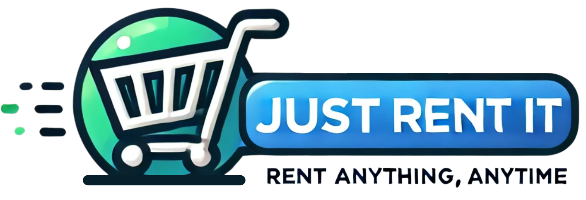
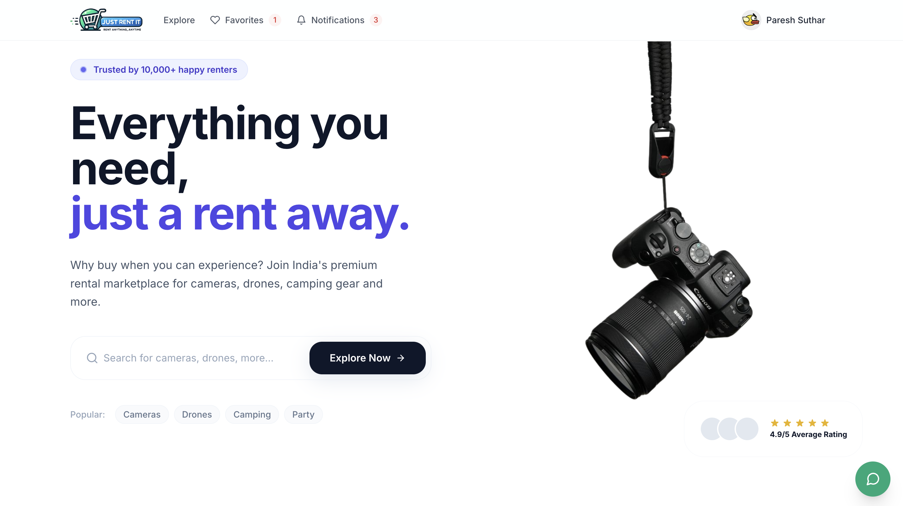
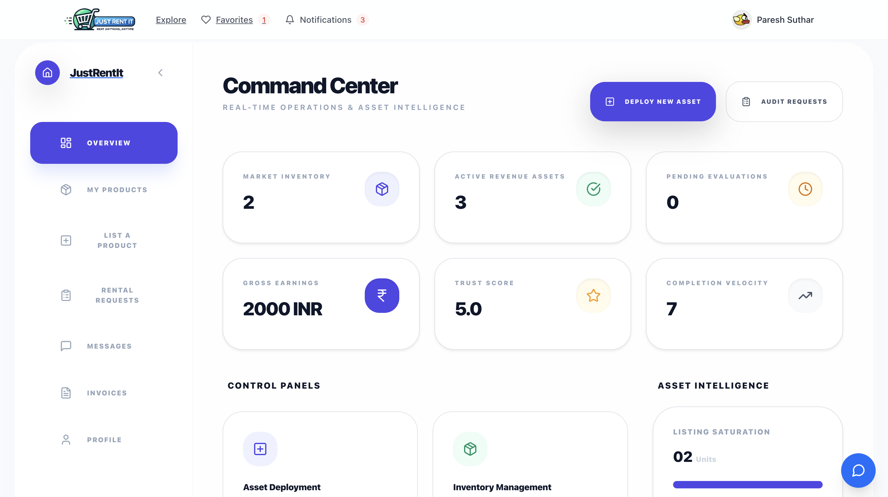
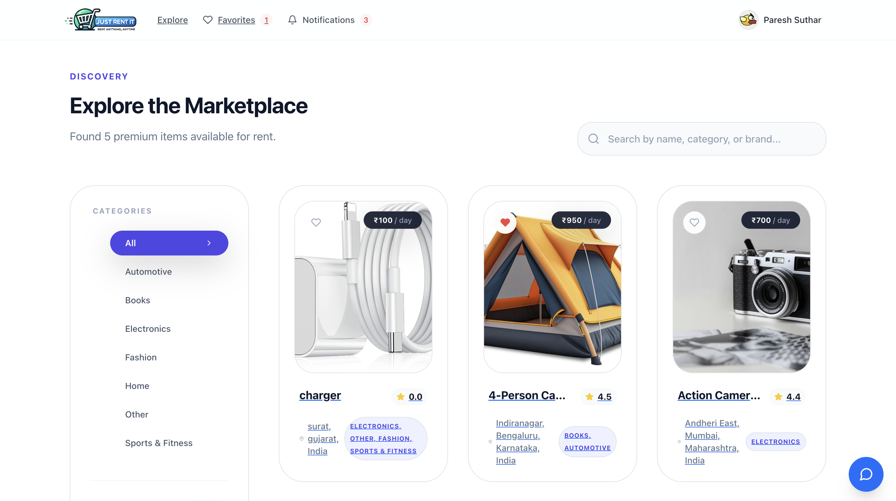
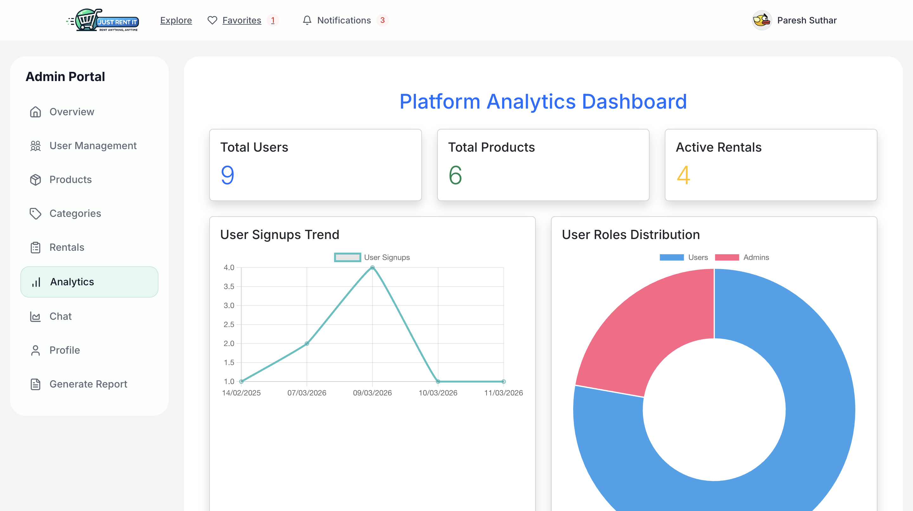
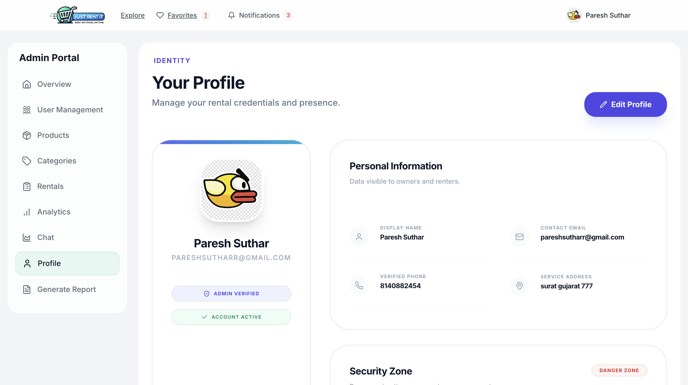
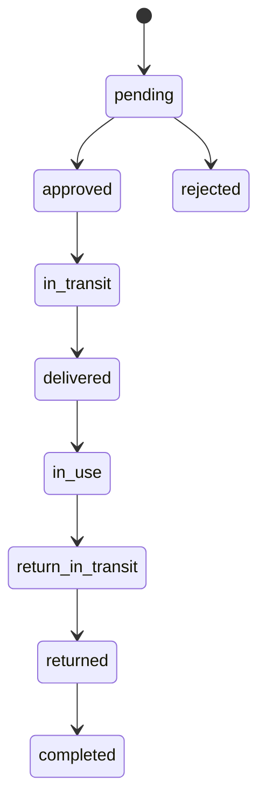

# JustRentIt Major

<p align="center">
  
</p>

<p align="center">
  A full-stack rental marketplace where users can list products, request rentals, chat in real time, track rental progress, manage invoices, and rate completed transactions.
</p>

<p align="center">
  
  
  
  
</p>

## Overview

JustRentIt is a rental platform built with a separate `client` and `server` application. It supports:

- user signup/login with JWT and Google OAuth
- product listing with image uploads, pricing, condition, category, and location
- rental request lifecycle management
- real-time chat between renter and owner
- notifications, favorites, ratings, and invoices
- admin dashboards for users, products, rentals, categories, analytics, and PDF reports

## Screenshots / UI Preview

These screenshots are sourced from the repository's `images-ss/` folder.

### Landing Page



Modern homepage with hero search, featured browsing, favorites, notifications, and premium marketplace branding.

### User Dashboard



Command center for product owners to manage listings, requests, earnings, messages, invoices, and account activity.

### Marketplace / Explore



Search and discovery experience with category filters, pricing cards, ratings, and product location metadata.

### Admin Analytics Dashboard



Admin-side analytics view covering user growth, product counts, active rentals, and visual reporting with charts.

### Admin Profile



Profile management screen for identity details, contact information, verification state, and account controls.

## Key Features

- Authentication with email/password and Google sign-in
- Product listing and self-managed dashboard for owners
- Search, category filtering, pricing filters, and favorites
- Rental requests with status flow from request to completion
- Owner and renter chat powered by Socket.IO
- Ratings for users and products after rentals
- Notification center for major account and rental events
- Invoice generation and downloadable records
- Admin controls for user management, product moderation, rentals, analytics, and reports

## Tech Stack

### Frontend

- React 18
- Vite
- React Router
- Axios
- Bootstrap, Tailwind utilities, Mantine, Chart.js

### Backend

- Node.js
- Express
- Mongoose
- JWT authentication
- Google OAuth verification
- Multer for image uploads
- Socket.IO
- PDFKit

### Database

- MongoDB

## Project Structure

```text
justrentit-major/
├── client/              # React + Vite frontend
├── server/              # Express + MongoDB backend
├── messaging-module/    # Additional messaging-related module
├── PROJECT_DOCUMENTATION.md
└── README.md
```

## Main Modules

### User Side

- Home and search pages
- Product details and rental request flow
- Favorites
- User dashboard
- My products
- Rental requests and progress tracking
- Chat and invoices
- Profile and notifications

### Admin Side

- Dashboard overview
- User management
- Product verification and featuring
- Rental request management
- Category management
- Analytics dashboard
- PDF report generation

## Rental Lifecycle



## Local Setup

### 1. Clone the repository

```bash
git clone <your-repo-url>
cd justrentit-major
```

### 2. Install dependencies

```bash
cd server
npm install

cd ../client
npm install
```

### 3. Configure environment variables

Create these files from the included examples:

- `server/.env`
- `client/.env`

#### Server `.env`

Use [`server/.env.example`](server/.env.example) as the base:

```env
PORT=3001
MONGODB_URI=your_mongodb_connection_string
JWT_SECRET=your_jwt_secret
GOOGLE_CLIENT_ID=your_google_client_id
CLIENT_URL=http://localhost:5173,https://your-frontend-domain.com
```

#### Client `.env`

Use [`client/.env.example`](client/.env.example) as the base:

```env
VITE_API_BASE_URL=http://localhost:3001
VITE_GOOGLE_CLIENT_ID=your_google_client_id
```

### 4. Start the backend

```bash
cd server
npm run dev
```

### 5. Start the frontend

```bash
cd client
npm run dev
```

### 6. Open the app

```text
Frontend: http://localhost:5173
Backend:  http://localhost:3001
```

## Available Scripts

### Client

```bash
npm run dev
npm run build
npm run preview
npm run lint
```

### Server

```bash
npm run dev
npm start
```

## API Areas

The backend is organized around these route groups:

- `/api/auth`
- `/api/products` and `/api/rentproduct/add`
- `/api/my-products`
- `/api/rental-requests`
- `/api/chat`
- `/api/notifications`
- `/api/ratings`
- `/api/invoices`
- `/api/admin`
- `/api/admin/users`
- `/api/admin/products`
- `/api/admin/rentals`

## Deployment Notes

This project is structured for split deployment:

- frontend on Vercel or similar static hosting
- backend on Render or similar Node hosting
- MongoDB Atlas for the database

Make sure the following are aligned in production:

- `VITE_API_BASE_URL`
- `CLIENT_URL`
- CORS allowed origins
- Google OAuth client configuration

## Documentation

For the extended academic/project write-up, see [`PROJECT_DOCUMENTATION.md`](PROJECT_DOCUMENTATION.md).

## Known Gaps

- No root workspace script to run client and server together
- Test automation is minimal
- Payment gateway integration is not fully productized
- Some UI modules still need cleanup and consistency work

## Future Improvements

- Add payment gateway integration
- Add automated test coverage
- Add stronger validation and auditing
- Improve image storage with cloud object storage
- Add recommendation and fraud-prevention workflows

## License

This repository currently does not include a dedicated license file. Add one if you plan to distribute or open-source the project.
